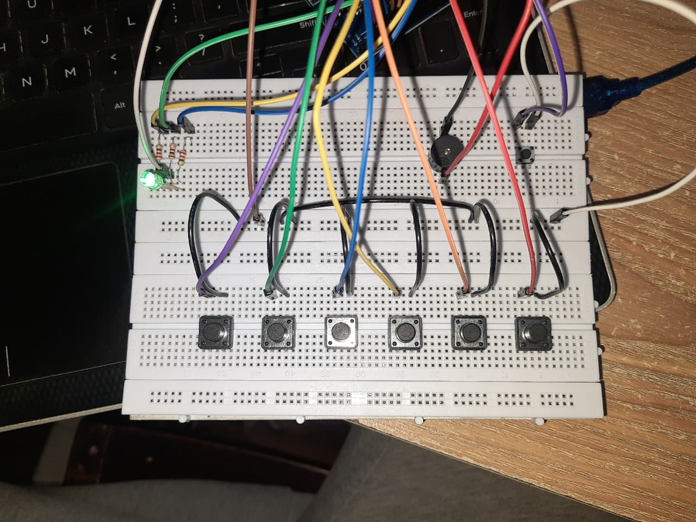

# multi-mode-arduino-piano
6-key Arduino piano with 3 tone modes and RGB indication.
## Demo

## Features
- 6 playable keys  
- 3 tone modes  
- RGB LED mode indication  
- Passive buzzer output  
- Uses INPUT_PULLUP (no external resistors for buttons)

## Documentation
Full tutorial: [PDF Guide](mini_piano.pdf)
